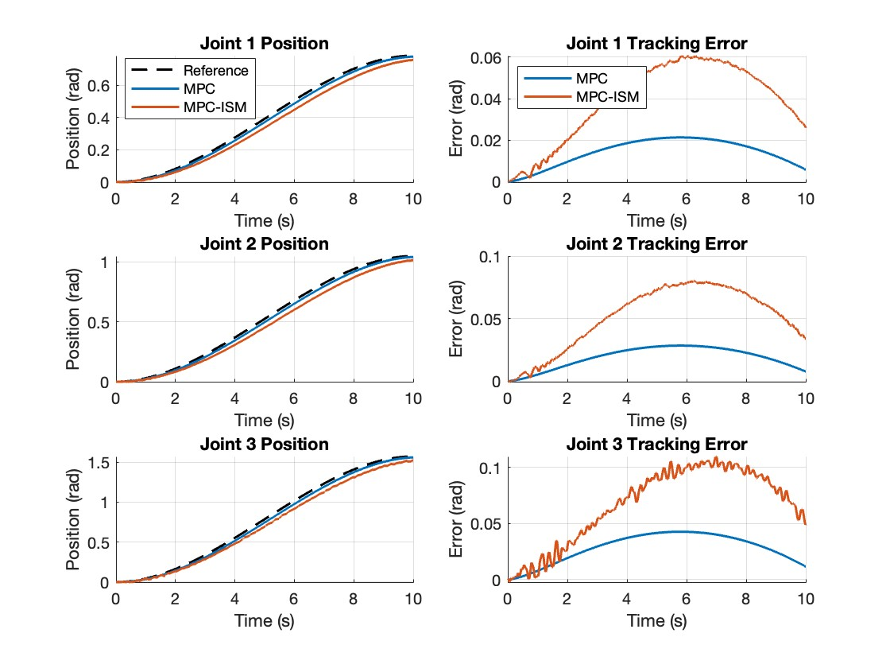
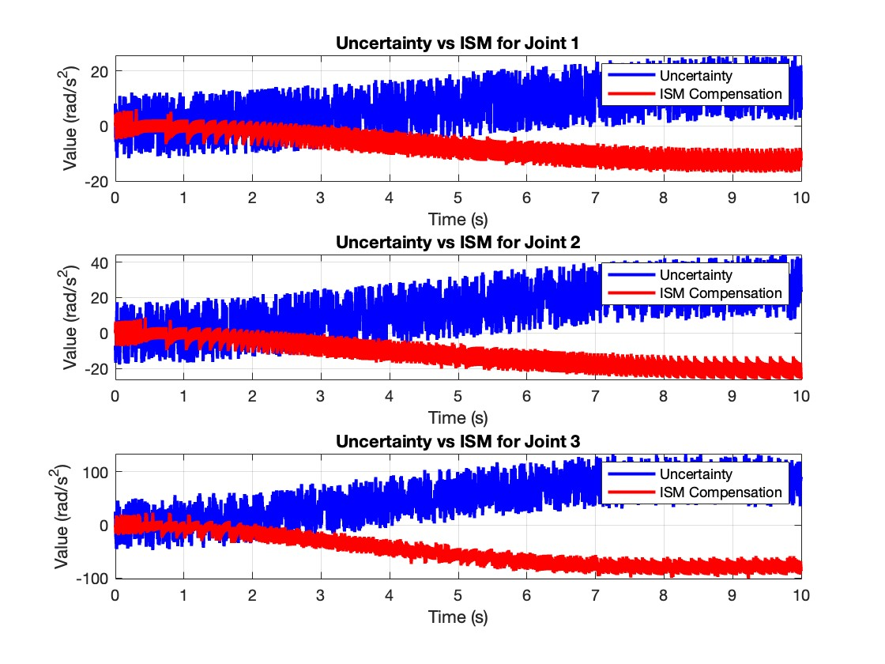

# MPC-Project
## MATLAB Simulation and Implementation of an MPC-ISM Controller for a 3 DOF Robot Manipulator

Traditional MPC struggles with complex robotic systems due to complex nonlinear dynamics, modelling uncertainties and computational cost. 
This solution suggests a heirarchical form of control utilising Inverse Dynamics, Integral Sliding Modes, and traditional MPC. The paper suggests that the usage of ISM helps better handle the uncertainties, and our implementation of the algorithm proves the same. This algorithm leads to a simplified MPC optimization, and significantly reduces computational complexity. 


## Joint Error Plot with the Heirarchical Algorithm



## Uncertainty Compensation



## Features

- **Robot Model:** 3-link manipulator with forward kinematics, Jacobian, and animation support ([`Robot`](Robot.m)).
- **Controllers:**
  - **MPC:** Discrete-time linear MPC with state and input constraints ([`MPController`](MPController.m)).
  - **ISM:** Integral Sliding Mode controller for robust uncertainty compensation ([`ISMController`](ISMController.m)).
  - **Inverse Dynamics:** Computes required torques considering robot dynamics and uncertainties ([`InverseDynamicsController`](InverseDynamicsController.m)).
  - **Combined MPC-ISM:** Hierarchical controller integrating MPC, ISM, and inverse dynamics ([`InverseDynamicsISMMPCController`](InverseDynamicsISMMPCController.m)).
- **Simulation:** Batch simulation and visualization of controller performance ([`RobotSimulator`](RobotSimulator.m)).
- **Trajectory Generation:** Smooth cubic polynomial interpolation for joint trajectories.
- **Visualization:** Plots for joint tracking, control effort, tracking errors, and 3D animation of the robot.

## File Structure

- [`driver.m`](driver.m): Main script to set up the robot, controllers, run simulations, and visualize results.
- [`Robot.m`](Robot.m): Robot manipulator model and kinematics.
- [`MPController.m`](MPController.m): Model Predictive Controller implementation.
- [`ISMController.m`](ISMController.m): Integral Sliding Mode Controller.
- [`InverseDynamicsController.m`](InverseDynamicsController.m): Inverse dynamics and uncertainty modeling.
- [`InverseDynamicsISMMPCController.m`](InverseDynamicsISMMPCController.m): Combined MPC-ISM controller.
- [`RobotSimulator.m`](RobotSimulator.m): Simulation and result visualization.
- `MPC for Robot Manipulators with Integral Sliding Modes Generation.pdf`: Reference paper by Icremona, Ferrara, Magni in the IEEE/ASME Transactions on mechatronics
- Images: Block diagrams and error plots.

## Getting Started

### Prerequisites

- MATLAB R2018b or newer (tested)
- Optimization Toolbox (for `quadprog`)

### Running the Simulation

1. Clone this repository.
2. Open MATLAB and set the working directory to the project folder.
3. Run the main script:

   ```matlab
   driver.m